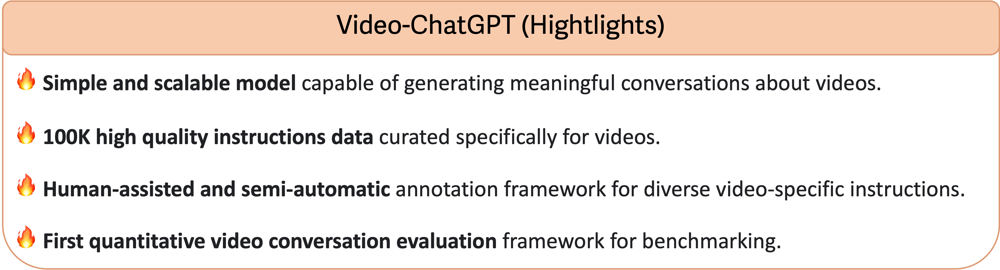
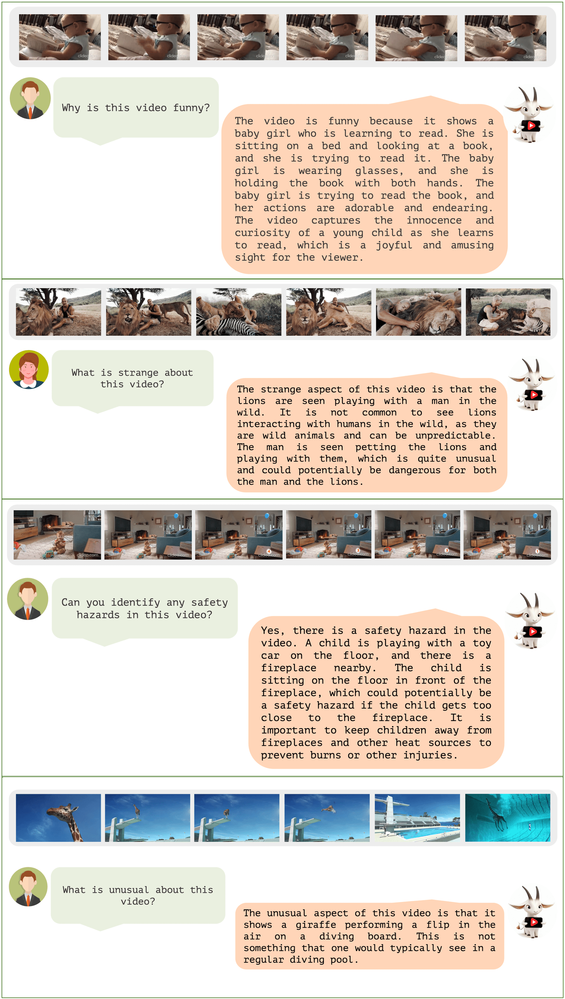
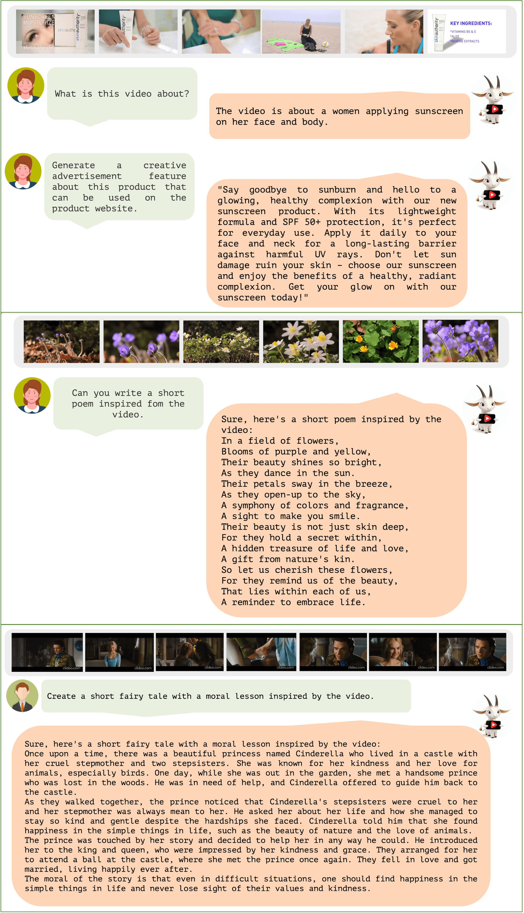
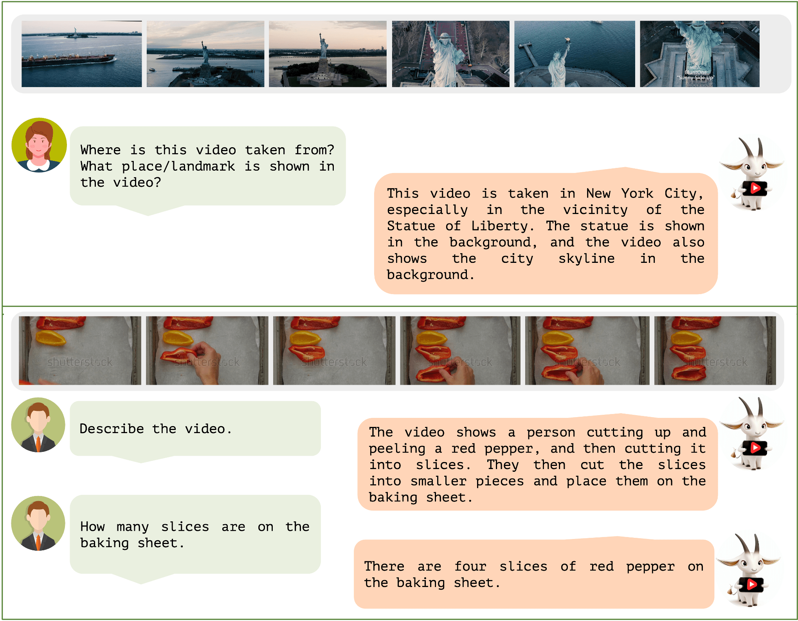
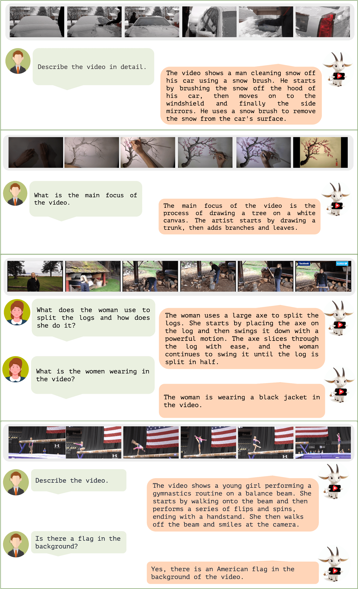
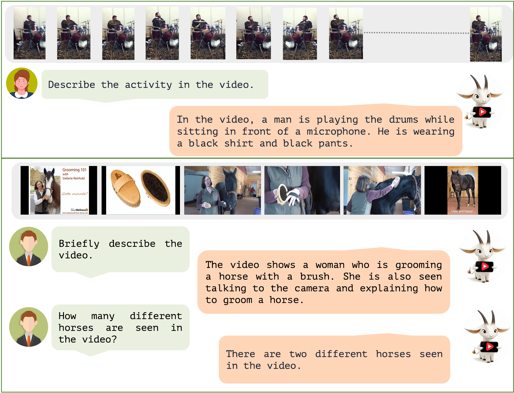
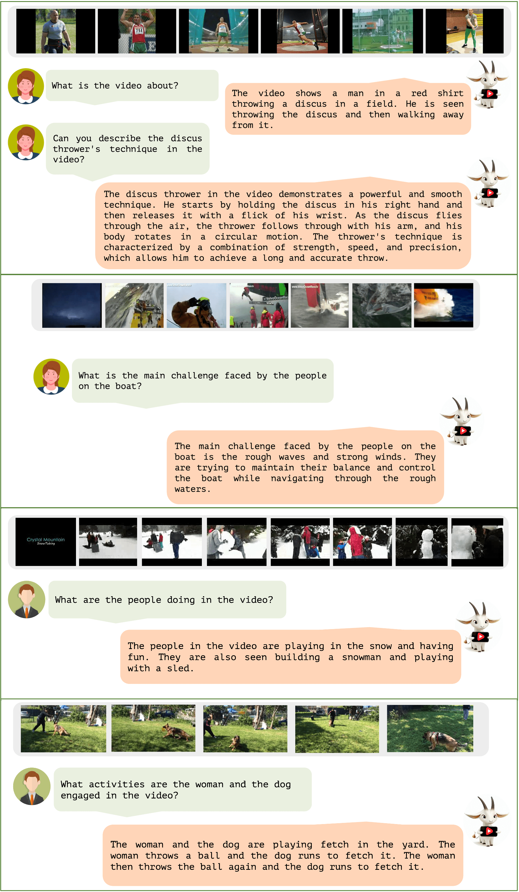
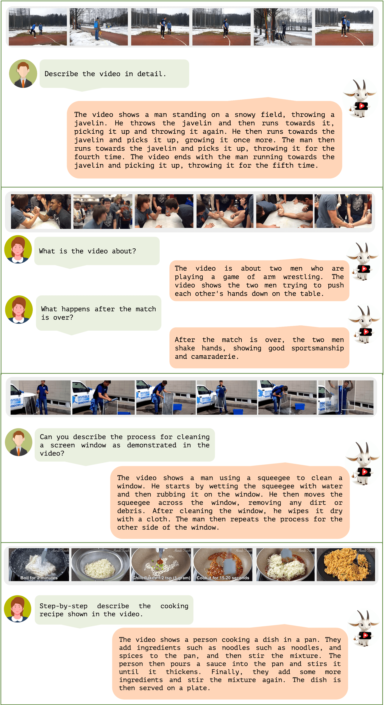

# Oryx Video-ChatGPT :movie_camera: :speech_balloon:

<p align="center">
    
</p>

### Video-ChatGPT: Towards Detailed Video Understanding via Large Vision and Language Models

#### [Muhammad Maaz](https://www.muhammadmaaz.com)* , [Hanoona Rasheed](https://www.hanoonarasheed.com/)* , [Salman Khan](https://salman-h-khan.github.io/) and [Fahad Khan](https://sites.google.com/view/fahadkhans/home)
\* Equally contributing first authors

#### **Mohamed bin Zayed University of Artificial Intelligence**

---

| Demo | Paper | Demo Clips | Offline Demo | Training | Video Instruction Data | Quantitative Evaluation | Qualitative Analysis |
| :---: | :---: | :---: | :---: | :---: | :---: | :---: | :---: |
| [](https://www.ival-mbzuai.com/video-chatgpt) [](https://youtu.be/fRhm---HWJY) | []() | [](https://youtu.be/R8qW5EJD2-k) [](https://youtu.be/ujCxqxMXLVw) [](https://youtu.be/97IWKMsbZ80) [](https://youtu.be/ZyJZfTg_Ttc) | [Offline Demo](#running-demo-offline-cd) | [Training](#training-train) | [Video Instruction Dataset](#video-instruction-dataset-open_file_folder) | [Quantitative Evaluation](#quantitative-evaluation-bar_chart) | [Qualitative Analysis](#qualitative-analysis-mag) |

---

## :loudspeaker: Latest Updates
- **Jun-08** : Released the training code, offline demo, instructional data and technical report. 
All the resources including models, datasets and extracted features are available 
[here](https://mbzuaiac-my.sharepoint.com/:f:/g/personal/hanoona_bangalath_mbzuai_ac_ae/Eudc2kLOX4hIuCenDmFe-UIBthkBQKpF9p6KrY2q_s9hwQ?e=zHKbTX). :fire::fire:
- **May-21** : Video-ChatGPT: demo released.

---

## Online Demo :computer:

:fire::fire: **You can try our demo using the provided examples or by uploading your own videos [HERE](https://www.ival-mbzuai.com/video-chatgpt).** :fire::fire:

:fire::fire: **Or click the image to try the demo!** :fire::fire:
[](https://www.ival-mbzuai.com/video-chatgpt)
You can access all the videos we demonstrate on [here](https://mbzuaiac-my.sharepoint.com/:f:/g/personal/hanoona_bangalath_mbzuai_ac_ae/EqrZjHG0KoFNhx6nDcCmFU0BtRqWyg8_zUgzvNQDY5t_3Q?e=AoEdnI).

---

## Video-ChatGPT Overview :bulb:

Video-ChatGPT is a video conversation model capable of generating meaningful conversation about videos. 
It combines the capabilities of LLMs with a pretrained visual encoder adapted for spatiotemporal video representation.

<p align="center">
  
</p>

---

## Contributions :trophy:

- We introduce 100K high-quality video-instruction pairs together with a novel annotation framework that is scalable and generates a diverse range of video-specific instruction sets of high-quality.
- We develop the first quantitative video conversation evaluation framework for benchmarking video conversation models.
- Unique multimodal (vision-language) capability combining video understanding and language generation that is comprehensively 
evaluated using quantitative and qualitiative comparisons on video reasoning, creativitiy, spatial and temporal understanding, and action recognition tasks.

<p align="center">
  
</p>

---

## Installation :wrench:

We recommend setting up a conda environment for the project:
```shell
conda create --name=video_chatgpt python=3.10
conda activate video_chatgpt

git clone https://github.com/mbzuai-oryx/Video-ChatGPT.git
cd Video-ChatGPT
pip install -r requirements.txt

export PYTHONPATH="./:$PYTHONPATH"
```

---

## Running Demo Offline :cd:

To run the demo offline, please refer to the instructions in [offline_demo.md](docs/offline_demo.md).

---

## Training :train:

For training instructions, check out [train_video_chatgpt.md](docs/train_video_chatgpt.md).

---

## Video Instruction Dataset :open_file_folder:

We are releasing our 100,000 high-quality video instruction dataset that was used for training our Video-ChatGPT model. You can download the dataset from 
[here](https://mbzuaiac-my.sharepoint.com/:u:/g/personal/hanoona_bangalath_mbzuai_ac_ae/EWxYslvDeX1PijKWM_WxTkkBDXDDD350YnUQOkbcL8V7Xg?e=Lq9itD). 
More details on our human-assisted and semi-automatic annotation framework for generating the data are available at [VideoInstructionDataset.md](quantitative_evaluation/README.md).

---

## Quantitative Evaluation :bar_chart:

For detailed instructions on performing quantitative evaluation, please refer to [QuantitativeEvaluation.md](quantitative_evaluation/README.md).

**Video-based Generative Performance Benchmarking**  and **Zero-Shot Question-Answer Evaluation** tables are provided for a detailed performance overview. 

### Zero-Shot Question-Answer Evaluation

| **Model** | **MSVD** |  | **MSRVTT** |  | **TGIF** |  | **Activity Net** |  |
| --- | :---: | :---: | :---: | :---: | :---: | :---: | :---: | :---: |
| | **Accuracy** | **Score** | **Accuracy** | **Score** | **Accuracy** | **Score** | **Accuracy** | **Score** |
| FrozenBiLM | 32.2 | -- | 16.8 | -- | 41.0 | -- | 24.7 | -- |
| Video Chat | 56.3 | 2.8 | 45.0 | 2.5 | 34.4 | 2.3 | 26.5 | 2.2 |
| Video-ChatGPT | 64.9 | 3.3 | 49.3 | 2.8 | 51.4 | 3.0 | 35.2 | 2.7 |

---

### Video-based Generative Performance Benchmarking

| **Evaluation Aspect** | **Video Chat** | **Video-ChatGPT** |
| --- |:--------------:|:-----------------:|
| Correctness of Information |      2.50      |       2.25        |
| Detail Orientation |      2.50      |       2.57        |
| Contextual Understanding |      2.54      |       2.69        |
| Temporal Understanding |      1.98      |       2.16        |
| Consistency |      1.84      |       2.20        |

---

## Qualitative Analysis :mag:
A Comprehensive Evaluation of Video-ChatGPT's Performance across Multiple Tasks.

### Video Reasoning Tasks :movie_camera:


---
### Creative and Generative Tasks :paintbrush:


---
### Spatial Understanding :globe_with_meridians:


---
### Video Understanding and Conversational Tasks :speech_balloon:


---
### Action Recognition :runner:


---
### Question Answering Tasks :question:


---
### Temporal Understanding :hourglass_flowing_sand:


---

## Acknowledgements :pray:

+ [LLaMA](https://github.com/facebookresearch/llama): A great attempt towards open and efficient LLMs!
+ [Vicuna](https://github.com/lm-sys/FastChat): Has the amazing language capabilities!
+ [LLaVA](https://github.com/haotian-liu/LLaVA): our architecture is inspired from LLaVA.
+ Thanks to our colleagues at MBZUAI for their essential contribution to the video annotation task, 
including Salman Khan, Fahad Khan, Abdelrahman Shaker, Shahina Kunhimon, Muhammad Uzair, Sanoojan Baliah, Malitha Gunawardhana, Akhtar Munir, 
Vishal Thengane, Vignagajan Vigneswaran, Jiale Cao, Nian Liu, Muhammad Ali, Gayal Kurrupu, Roba Al Majzoub, 
Jameel Hassan, Hanan Ghani, Muzammal Naseer, Akshay Dudhane, Jean Lahoud, Awais Rauf, Sahal Shaji, Bokang Jia,
without which this project would not be possible.

If you're using Video-ChatGPT in your research or applications, please cite using this BibTeX:
```bibtex
@misc{maaz2023videochatgpt,
      title={Video-ChatGPT}, 
      author={Muhammad Maaz, Hanoona Rasheed, Salman Khan and Fahad Khan},
      journal={GitHub repository},
      year={2023},
      howpublished = {\url{https://github.com/hanoonaR/Video-ChatGPT}}}
```

## License :scroll:
<a rel="license" href="http://creativecommons.org/licenses/by-nc-sa/4.0/"></a><br />This work is licensed under a <a rel="license" href="http://creativecommons.org/licenses/by-nc-sa/4.0/">Creative Commons Attribution-NonCommercial-ShareAlike 4.0 International License</a>.


Looking forward to your feedback, contributions, and stars! :star2:
Please raise any issues or questions [here](https://github.com/mbzuai-oryx/Video-ChatGPT/issues). 


---
[](https://www.ival-mbzuai.com)
[](https://github.com/mbzuai-oryx)
[](https://mbzuai.ac.ae)
