# Oryx Video-ChatGPT

[Muhammad Maaz](https://www.muhammadmaaz.com)* , [Hanoona Rasheed](https://www.hanoonarasheed.com/)* , [Salman Khan](https://salman-h-khan.github.io/) and [Fahad Khan](https://sites.google.com/view/fahadkhans/home).

*Equal Contribution

**Mohamed bin Zayed University of Artificial Intelligence**

[](https://www.ival-mbzuai.com/video-chatgpt)
[](https://youtu.be/zG8RBtH4gb0)
[](https://youtu.be/R8qW5EJD2-k)
[](https://youtu.be/ujCxqxMXLVw)
[](https://youtu.be/97IWKMsbZ80)
[](https://youtu.be/ZyJZfTg_Ttc)

<p align="center">
     <br>
</p>

## :rocket: News

+ May-21 : Video-ChatGPT: demo released.

## Online Demo

:fire::fire: **You can try our demo using the provided examples or by uploading your own videos [HERE](https://www.ival-mbzuai.com/video-chatgpt).** :fire::fire:

:fire::fire: **Or click the image to try the demo!** :fire::fire:
[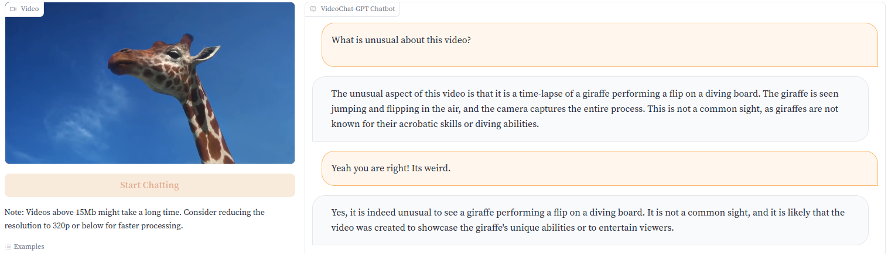](https://www.ival-mbzuai.com/video-chatgpt)
You can access all the videos we demonstrate on [here](https://mbzuaiac-my.sharepoint.com/:f:/g/personal/hanoona_bangalath_mbzuai_ac_ae/EqrZjHG0KoFNhx6nDcCmFU0BtRqWyg8_zUgzvNQDY5t_3Q?e=AoEdnI).

## About Video-ChatGPT

+ Video-ChatGPT is a large vision-language model with a dedicated video-encoder and large language model (LLM), enabling video understanding and conversation about videos.
+ A simple and scalable multimodal design on top of pretrained video and language encoders that adapts only a linear projection layer for multimodal alignment.
+ Data centric focus with human assisted and semi-automatic annotation framework for high-quality video instruction data.
+ Unique multimodal (vision-language) capability combining video understanding and language generation that is comprehensively evaluated using quantitative and qualitiative comparisons on video reasoning, creativitiy, spatial and temporal understanding, and action recognition tasks.


## Contributions
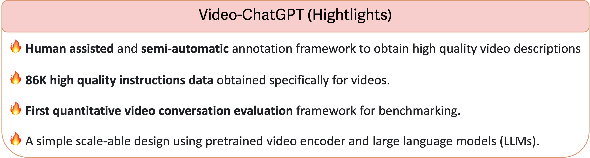

# Qualitative Analysis
### A Comprehensive Evaluation of Video-ChatGPT's Performance across Multiple Tasks.

## Video Reasoning Tasks
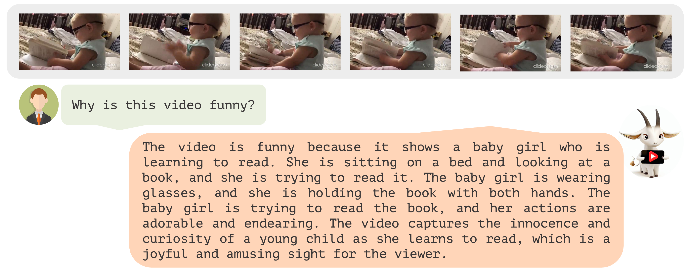
Access the video sample [here](https://mbzuaiac-my.sharepoint.com/:v:/g/personal/hanoona_bangalath_mbzuai_ac_ae/EfakvY9e8JhAsJO-2sovohMBBa4wj_Gukx5lIyLFD8MHzw?e=Xp8xmG).

---
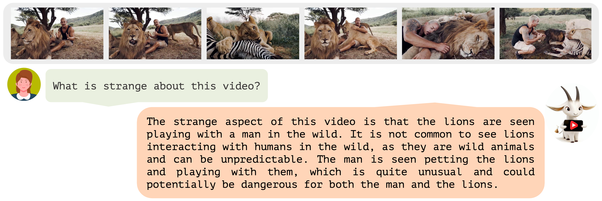
Access the video sample [here](https://mbzuaiac-my.sharepoint.com/:v:/g/personal/hanoona_bangalath_mbzuai_ac_ae/EXAa4FCJNaBKh8L9pVieXZMB2Ec0__9ZEdx-ZytByIpWWA?e=I7Oqir).

---
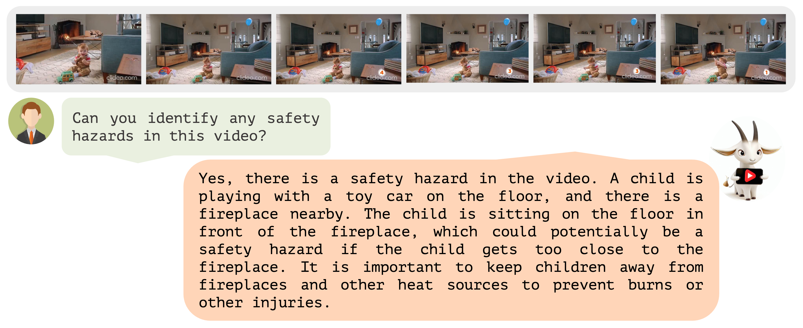
Access the video sample [here](https://mbzuaiac-my.sharepoint.com/:v:/g/personal/hanoona_bangalath_mbzuai_ac_ae/Efu9X_DUwSBCk66CVck2aeMB41c1rhJO0aI0VFi3uAv7gQ?e=W3ALWP).

---
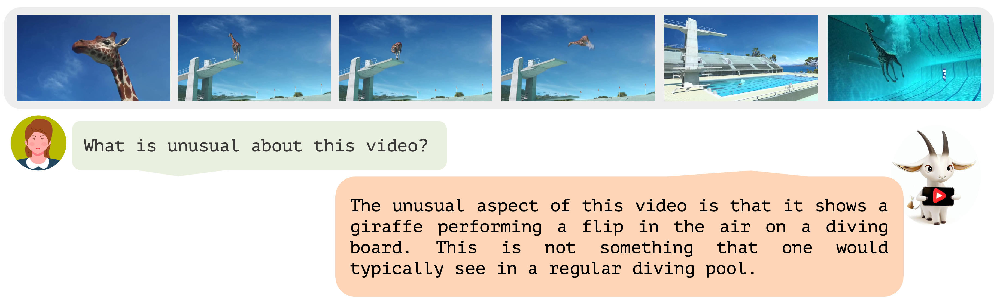
Access the video sample [here](https://mbzuaiac-my.sharepoint.com/:v:/g/personal/hanoona_bangalath_mbzuai_ac_ae/EROORiiFAsRFkBI0UmmjDZ8BX1s0rB5dqYGr220qiJqMDg?e=bWheMT).

---
## Creative and Generative Tasks

Access the video sample [here](https://mbzuaiac-my.sharepoint.com/:v:/g/personal/hanoona_bangalath_mbzuai_ac_ae/EXAa4FCJNaBKh8L9pVieXZMB2Ec0__9ZEdx-ZytByIpWWA?e=I7Oqir).

---
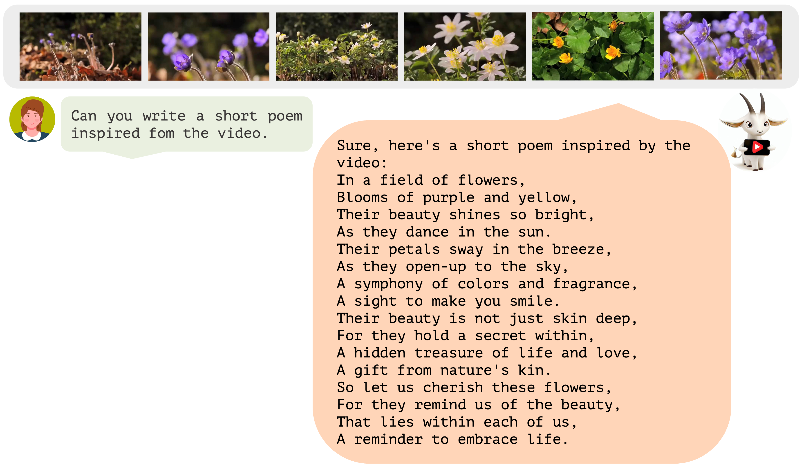
Access the video sample [here](https://mbzuaiac-my.sharepoint.com/:v:/g/personal/hanoona_bangalath_mbzuai_ac_ae/EdcVC4voeXZOh51u2lsLwUMBcnpS2dI5yu1agyw0EUXIPQ?e=XKHHin).

---
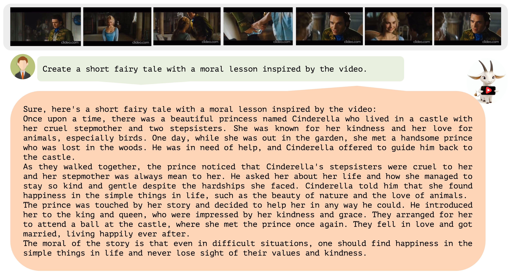
Access the video sample [here](https://mbzuaiac-my.sharepoint.com/:v:/g/personal/hanoona_bangalath_mbzuai_ac_ae/EUbaFuoEu8BBtXiv0nj7L2MBd2qBKhG_G-LC2iTv20rKdQ?e=sfn8L1).

---
## Spatial Understanding
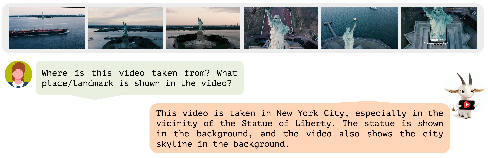
Access the video sample [here](https://mbzuaiac-my.sharepoint.com/:v:/g/personal/hanoona_bangalath_mbzuai_ac_ae/EbntpwutV1ZMr98fo6ZD-mABtJOTrtDXNuhLESaBMuZA0w?e=92ZZaK).

---
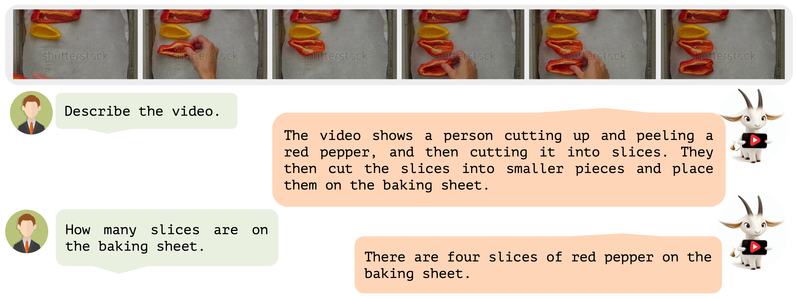
Access the video sample [here](https://mbzuaiac-my.sharepoint.com/:v:/g/personal/hanoona_bangalath_mbzuai_ac_ae/ERoJxH6xPZRGhyXjgjzt_9wBgV67TuT-UaGp4We2sU_wiA?e=Z7UMUO).

---
## Video Understanding and Conversational Tasks
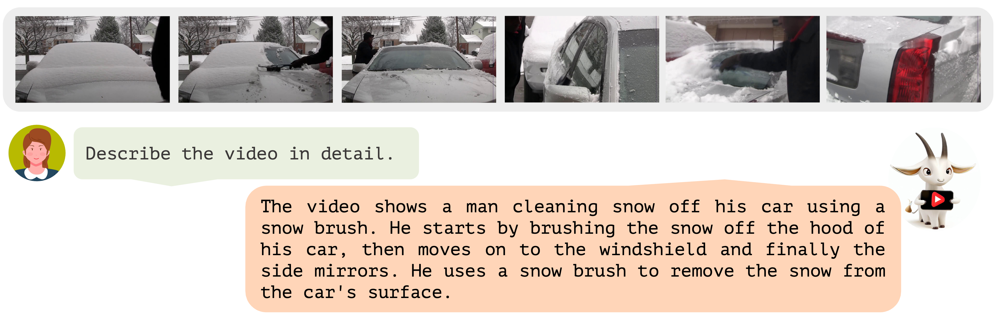
Access the video sample [here](https://mbzuaiac-my.sharepoint.com/:v:/g/personal/hanoona_bangalath_mbzuai_ac_ae/EdcvHSbmVbBGtW33TlCb_moByzeXZAoeKKNziqgt3qAdjQ?e=rBlTbJ).

---
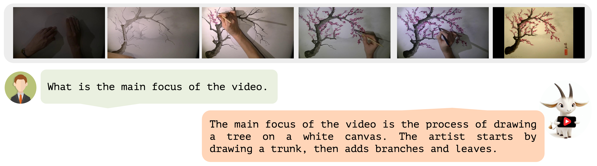
Access the video sample [here](https://mbzuaiac-my.sharepoint.com/:v:/g/personal/hanoona_bangalath_mbzuai_ac_ae/EUBRniuQBOJOsTfX8hq2PFIBnzfoNewkT_L33e9LgOM2Bw?e=1yMczi).

---
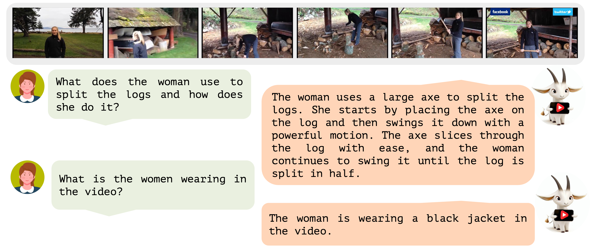
Access the video sample [here](https://mbzuaiac-my.sharepoint.com/:v:/g/personal/hanoona_bangalath_mbzuai_ac_ae/EevChBfqMRpFuLriH0hmkKQBYx7aDtvfc1CQu2ZQdietBg?e=apfFbO).

---
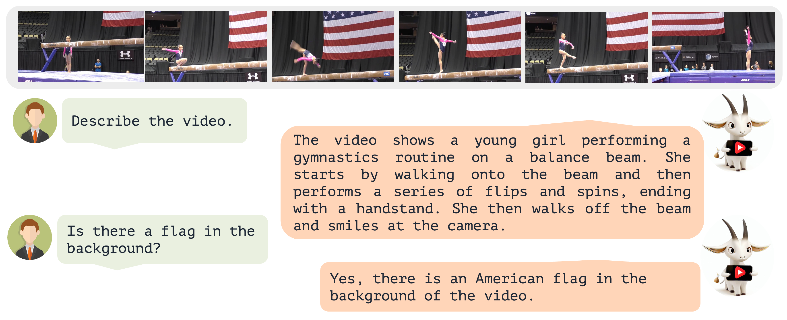
Access the video sample [here](https://mbzuaiac-my.sharepoint.com/:v:/g/personal/hanoona_bangalath_mbzuai_ac_ae/EQcP5HfajPtNm580LEzzWe4BDQBCE75maODs-OBNwYTjrQ?e=BtK5bY).

---
## Question Answering Tasks
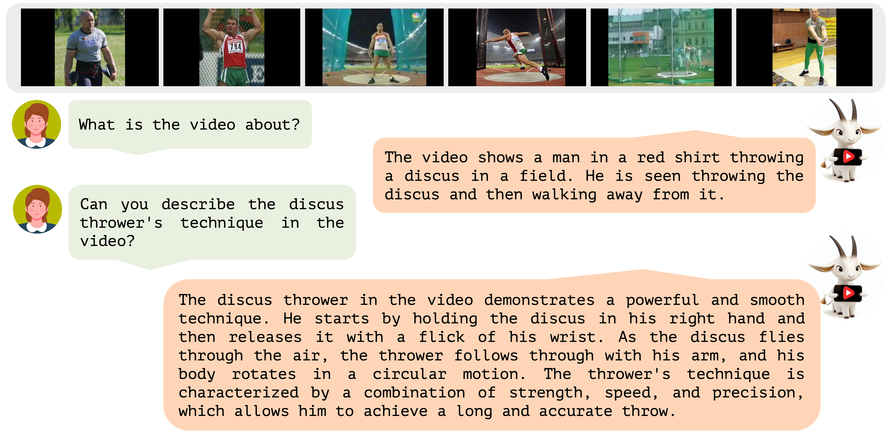
Access the video sample [here](https://mbzuaiac-my.sharepoint.com/:v:/g/personal/hanoona_bangalath_mbzuai_ac_ae/Ea2tckF43lNCuaK6vN5PM6EBZkRH8_SL1jckWZu_G-uxHw?e=aFtWvl).

---
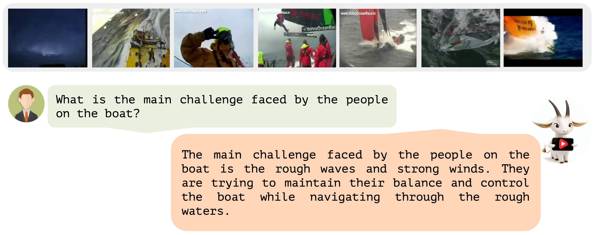
Access the video sample [here](https://mbzuaiac-my.sharepoint.com/:v:/g/personal/hanoona_bangalath_mbzuai_ac_ae/EY5gWll_hI1DrTo2iRfB6qYB3dZiFGIWhVo4eP7pZ0Djwg?e=6rcnRh).

---

Access the video sample [here](https://mbzuaiac-my.sharepoint.com/:v:/g/personal/hanoona_bangalath_mbzuai_ac_ae/EeFS9qLeLbhPlg_vzKXn-H0BFA4CAyCe4y06qxaRv0PqUg?e=EukvFO).

---
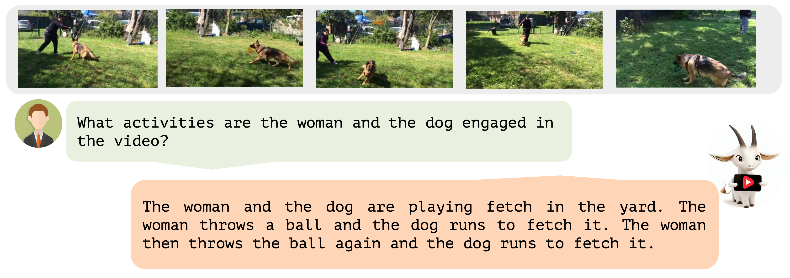
Access the video sample [here](https://mbzuaiac-my.sharepoint.com/:v:/g/personal/hanoona_bangalath_mbzuai_ac_ae/Ee6gG4VMuwRJvCZIURkbzPwBnTO6tA0HJLfW9ABRWiEXxw?e=GC1NIj).

---
## Temporal Understanding
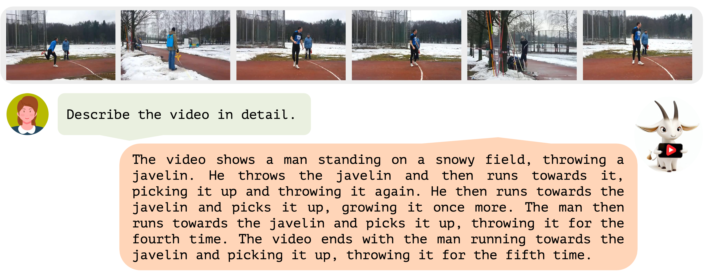
Access the video sample [here](https://mbzuaiac-my.sharepoint.com/:v:/g/personal/hanoona_bangalath_mbzuai_ac_ae/EaLGruCDJCtHoOnjtMV1OWEBNp7XlshruT0B2ItRttpdUw?e=5RQ418).

---
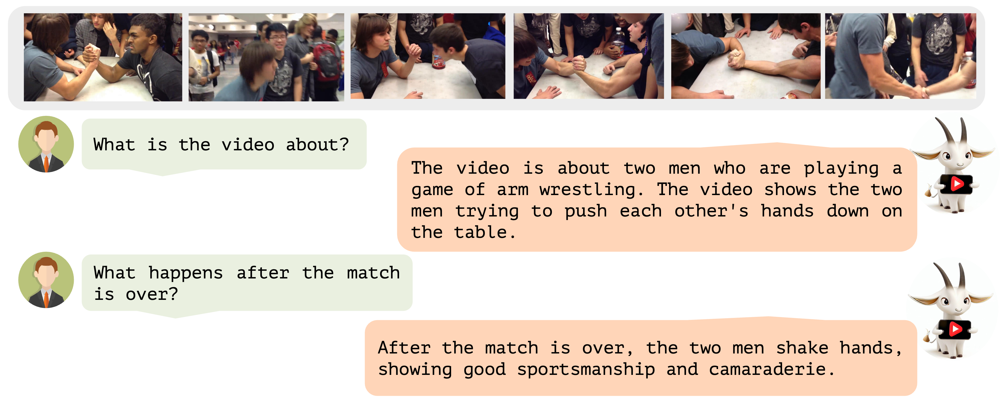
Access the video sample [here](https://mbzuaiac-my.sharepoint.com/:v:/g/personal/hanoona_bangalath_mbzuai_ac_ae/EVB1zq4zJlZFjc8MaOG8AIgBEZHeKU0VVlO4C7dOq3WDKw?e=HQNLAK).

---
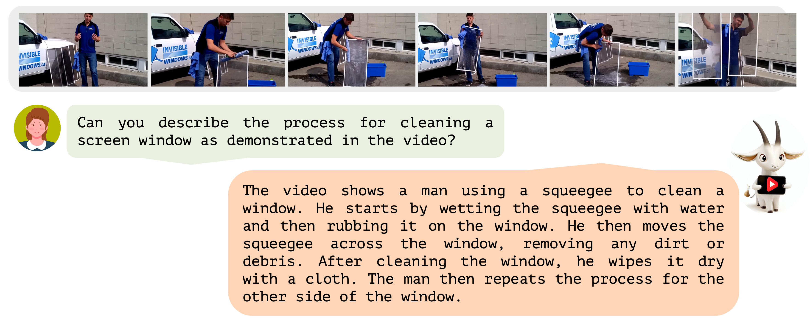
Access the video sample [here](https://mbzuaiac-my.sharepoint.com/:v:/g/personal/hanoona_bangalath_mbzuai_ac_ae/EZzAOgIAnI5Lp3aPIjajuq4B_NEiRzKXG67nlVTPKwXtPw?e=zazR3X).

---
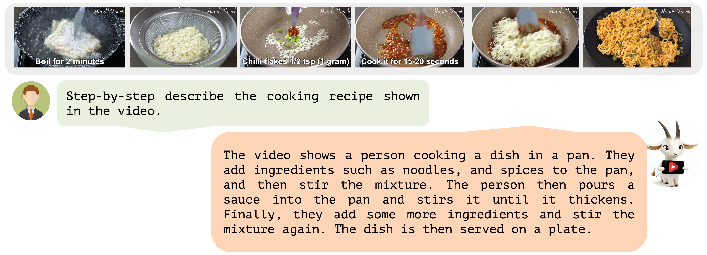
---
## Action recognition
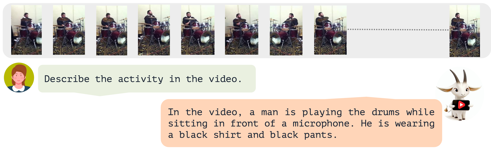
Access the video sample [here](https://mbzuaiac-my.sharepoint.com/:v:/g/personal/hanoona_bangalath_mbzuai_ac_ae/EddCTJ7b8ENJtZJTnBbZEP0BfkhG-B83pAauQVffDmSV_w?e=buZEKx).

---

Access the video sample [here](https://mbzuaiac-my.sharepoint.com/:v:/g/personal/hanoona_bangalath_mbzuai_ac_ae/EW9-oBsAnd1Lgp9Gcw3gK2gBKC-vxz7iEyF2om6kktjM5w?e=lxrECj).

---# Quantitative Analysis
### Benchmarking Video-ChatGPT's Performance with State-of-the-Art Metrics and Comparative Evaluation.
+ Develops the first quantitative video conversation evaluation framework for benchmarking the performance of video understanding generative models.
+ Evaluates Video-ChatGPT on open-ended question answering tasks using the MSRVTT and MSVD datasets.
+ Uses GPT-assisted evaluation to assess the model's capabilities, measuring the accuracy and relative score of generated predictions on a scale of 1-5 (shown on top of the bars in the bar chart below).
+ Compares the performance of VideoChat GPT with other models, including the generic video foundation model InternVideo and the video generative model Ask-Anything Video Chat.
+ Achieves state-of-the-art (SOTA) performance on both the MSRVTT and MSVD datasets, showcasing the model's exceptional performance in video understanding and question answering tasks.

<p align="center">
  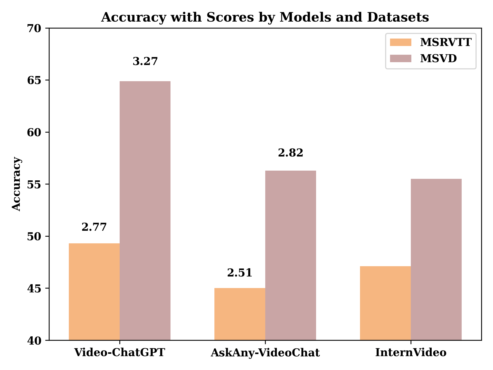
</p>

# Instruction Data for Model Tuning
We present the different types of data included in the instructional data prepared for model tuning, along with the methods used to enrich the ground truth annotations.
+ Data Types: The instructional data encompasses detailed descriptions, summarizations, question-answer pairs, creative/generative tasks, and conversational tasks, covering concepts from appearance, temporal relations, reasoning, and more.
+ Human Annotation Expansion: The original ground truth annotations are expanded and enriched by human annotators, who provide additional context and detail to enhance the instructional data.
+ Incorporation of context from Off-the-Shelf dense image captioning models: State-of-the-art dense captioning and prediction models are utilized to generate predictions that offer supplementary contextual information. A comprehensive method is employed to combine these predictions, leveraging some models specifically for removing noisy context from the data.
+ GPT-Assisted Postprocessing: The enriched data undergoes postprocessing using GPT models to refine and optimize the annotations, ensuring high-quality data for effective model training and improved performance.

## Instruction Data Types
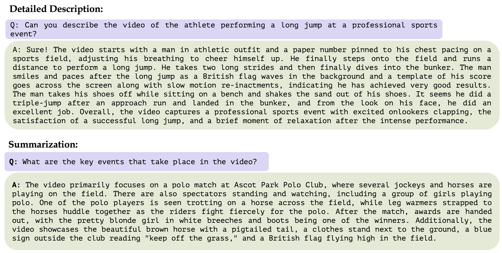
---

## Data Enrichment Methods
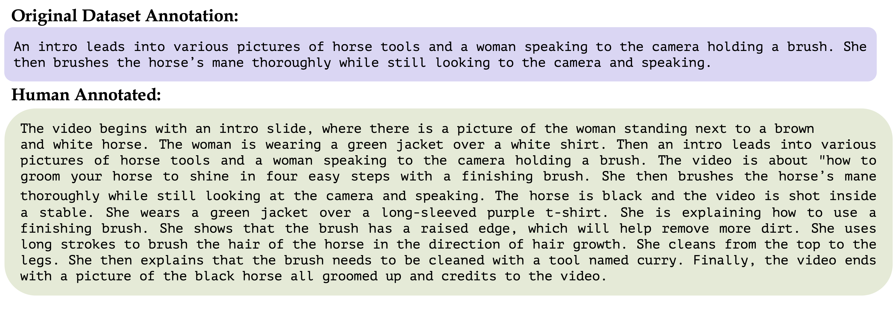
---


## Acknowledgement

+ [LLaMA](https://github.com/facebookresearch/llama): A great attempt towards open and efficient LLMs!
+ [Vicuna](https://github.com/lm-sys/FastChat): Has the amazing language capabilities!
+ [LLaVA](https://github.com/haotian-liu/LLaVA): our architecture is inspired from LLaVA.
+ Thanks to our colleagues at MBZUAI for their essential contribution to the video annotation task, 
including Dr. Salman Khan, Dr. Fahad Khan, Abdelrahman Shaker, Shahina Kunhimon, Muhammad Uzair, Sanoojan Baliah, Malitha Gunawardhana, Akhtar Munir, 
Vishal Thengane, Vignagajan Vigneswaran, Dr. Jiale Cao, Dr. Nian Liu, Muhammad Ali, Gayal Kurrupu, Roba Al Majzoub, 
Jameel Hassan, Hanan Ghani, Dr. Muzammal Naseer, Dr. Akshay Dudhane, Dr. Jean Lahoud, Awais Rauf,
without which this project would not be possible.


If you're using Video-ChatGPT in your research or applications, please cite using this BibTeX:
```bibtex
@misc{maaz2023videochatgpt,
      title={Video-ChatGPT}, 
      author={Muhammad Maaz, Hanoona Rasheed, Salman Khan and Fahad Khan},
      journal={GitHub repository},
      year={2023},
      howpublished = {\url{https://github.com/hanoonaR/Video-ChatGPT}}}
```

## License
Non-commercial bespoke license. Please refer to license terms [here](LICENSE).

---
<div>
  
  
  
</div>
