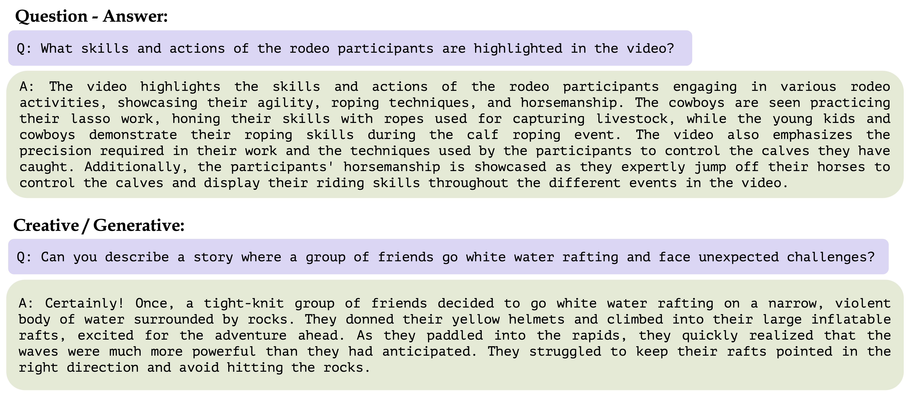
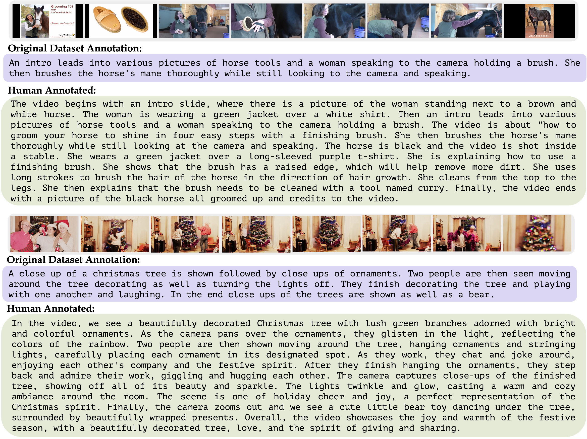
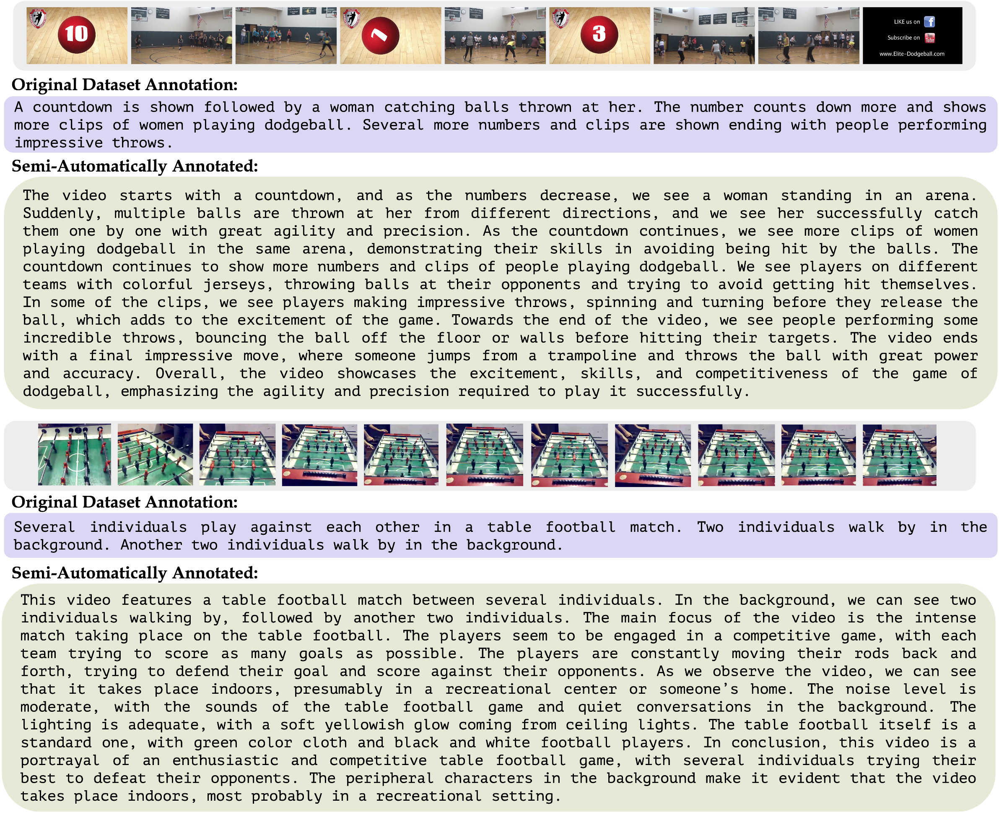

# Video Instruction Data Generation

This README outlines the method used for generating video instruction data, a resource tailored for the fine-tuning of Video-ChatGPT. Our approach employs a combination of human-assisted and semi-automatic annotation techniques, aiming to produce high-quality video instruction data.

These methods allow us to create question-answer pairs related to 

- Video summarization
- Description-based question-answers (exploring spatial, temporal, relationships, and reasoning concepts)
- Creative/generative question-answers

Explore a few sample instances here:

**Download Data**: You can download the 100K video-instruction data from 
[here](https://mbzuaiac-my.sharepoint.com/:u:/g/personal/hanoona_bangalath_mbzuai_ac_ae/EWxYslvDeX1PijKWM_WxTkkBDXDDD350YnUQOkbcL8V7Xg?e=Lq9itD).

## Human-Assisted Annotations

Utilizing video-caption pair datasets, we apply the expertise of human annotators to enrich the original ground truth annotations. This step is a continuous endeavor to enhance our dataset's quality and diversity

This figure shows how video-captions from a standard dataset are enriched and detailed by human annotation sample.

Question-answer pairs are generated on the enriched human-assisted video-descriptions, covering the various themes discussed above. For additional details, please refer to the script [`generate_instruction_qa_human_assisted.py`](generate_instruction_qa_human_assisted.py).

## Semi-Automatic Annotation Framework

To supplement the human-assisted annotations, we propose a semi-automatic annotation framework. This strategy leverages the advanced capabilities of dense image vision-language models, providing a cost-effective, scalable solution to boost our dataset's volume without compromising quality significantly.

The tools incorporated in this process include:

- **BLIP-v2**: Generates frame-level descriptions
- **GRIT**: Produces detailed captions
- **Tag2Text**: Generates tags for keyframes, serving as a filtering mechanism

The 'dense noisy captions' or the additional context information is derived by summarizing the predictions from these off-the-shelf models using the GPT3.5-Turbo model. Check out how video-captions from a standard dataset are enriched and detailed by the semi-automatic annotation method in this sample:

These 'dense noisy captions' are combined with the ground truth video-captions to generate further instructional question-answer pairs. For more insights, refer to the script [`generate_instruction_qa_semi_automatic.py`](generate_instruction_qa_semi_automatic.py).

## Detailed Descriptive Annotations

We also generate question-answer pairs aimed at long and detailed video descriptions by leveraging video-caption pair datasets. To understand the prompts employed for generating these descriptive annotations, please refer to the script [`generate_descriptive_qa.py`](generate_descriptive_qa.py).
